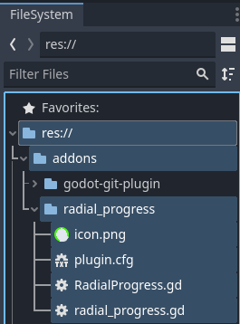
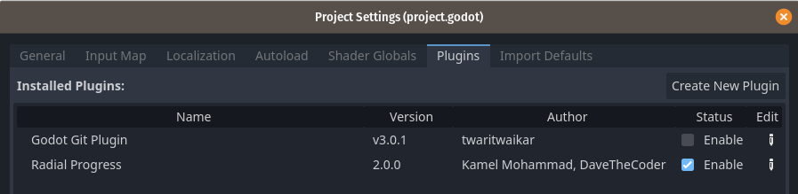
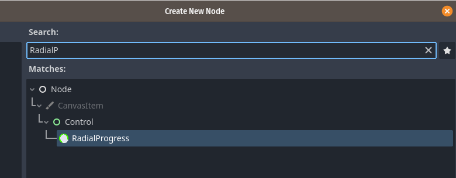

# Radial Progress Indicator
Radial progress indicator is a plugin for the Godot game engine. It is a Control that displays a radial progress indicator with several options.
 

## Properties

- max\_value : maximum value 
- progress : progress value 
- radius : radius of indicator 
- thickness : thickness of indicator 
- bg\_color : background color 
- bar\_color : indicator color 
- ring : bool  
- nb_points : int  

Set the *progress* property to a positive value to move the indicator clockwise, and to a negative value to move the indicator counterclockwise.

Instead of setting the *progress* property, the *animate* method can be called to move the progress indicator from *initial_value* to *max_value* over *duration* seconds.

If *ring* is true, only the outer ring will be rendered. 

Use *nb_points* to be able to change drawing accuracy.

- animate(duration: float, clockwise: bool = true, initial\_value: float = 0.0)  

## Installation

To use the plugin in a project, copy the folder **addons/radial_progress/** into the project folder. If installing from the Godot Editor AssetLib tab, only that folder needs to be installed.

Then enable the plugin in Project / Project Settings... / Plugins.

Now the RadialProgress is available when creating a new node.

## Demo

The repository includes a demo of the plugin. To use the demo, create a new folder containing the **addons/radial_progress/** subfolder and the contents of the **demo/** folder. Then use the Godot Project Manager to import a Godot project using the contents of the new folder.
