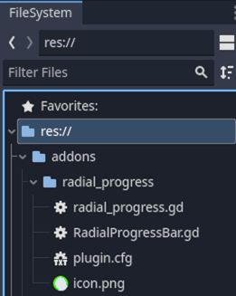

# Radial Progress Indicator
Radial progress indicator is a plugin for the Godot game engine. It is a Control that displays a radial progress indicator with several options.
 

## Properties 

- max\_value : maximum value 
- progress : progress value 
- radius : radius of indicator 
- thickness : thickness of indicator 
- bg\_color : background color 
- bar\_color : indicator color 

Set the *progress* property to a positive value to move the indicator clockwise, and to a negative value to move the indicator counterclockwise.

Instead of setting the *progress* property, the **animate* method can be called to move the progress indicator from *initial_value* to *max_value* over *duration* seconds.

- animate(duration: float, clockwise: bool = true, initial\_value: float = 0.0)  

## Installation

The plugin is provided inside a simple demonstration project.

To use the plugin in another project, copy the folder *addons/radial_progress* into the project folder.

